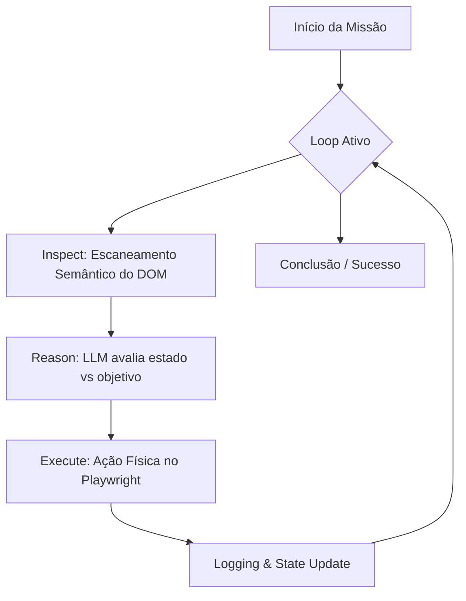

# OperantID 🤖 — High-Performance Autonomous Web Reasoning Framework

[](https://www.python.org/downloads/)
[](https://opensource.org/licenses/MIT)
[](https://playwright.dev/python/)

**OperantID** é um framework avançado de navegação autônoma que orquestra Large Language Models (LLMs) e automação de navegador (Playwright) para resolver tarefas complexas na Web. Diferente de ferramentas de RPA tradicionais, o OperantID utiliza **raciocínio semântico** em tempo real para interagir com interfaces dinâmicas, lidar com estados inesperados e tomar decisões baseadas em contexto.

---

## Sumário

- [Visão Técnica](#visao-tecnica)
- [Arquitetura de Raciocínio](#arquitetura-de-raciocinio)
- [Instalação](#instalacao)
- [Configuração de Provedores](#configuracao-de-provedores)
- [Guia de Uso Profundo](#guia-de-uso-profundo)
  - [Inicialização e Controle de Visibilidade](#inicializacao-e-controle-de-visibilidade)
  - [Automação de Login e Credenciais](#automacao-de-login-e-credenciais)
  - [Gestão de Múltiplas Abas](#gestao-de-multiplas-abas)
  - [Logs e Observabilidade](#logs-e-observabilidade)
  - [Bypass e Stealth Mode](#bypass-e-stealth-mode)
- [Playground UI](#playground-ui)
- [Referência da API](#referencia-da-api)
- [Licença](#licenca)

---

## Visao Tecnica

O OperantID resolve o problema da fragilidade de automações baseadas em seletores estáticos. Ele opera sobre uma abstração do DOM que extrai apenas elementos "interativos e semânticos", reduzindo o ruído para o modelo de IA e focando no que realmente importa para a tomada de decisão.

### Arquitetura de Raciocinio

O framework segue o paradigma **IRE (Inspect-Reason-Execute)**:



1. **Inspect**: O motor injeta um script otimizado que identifica âncoras, botões, inputs e elementos com `role` ARIA, atribuindo IDs temporários (`data-operant-id`).
2. **Reason**: O contexto enviado ao LLM inclui o histórico de ações, o mapa da página atual e o objetivo. O modelo decide a próxima ação (ex: `click`, `type`, `wait`).
3. **Execute**: A ação é traduzida em comandos Playwright, com mecanismos de auto-correção por texto caso o seletor ID falhe.

---

## Instalacao

```bash
pip install operantid
playwright install chromium
```

---

## Configuracao de Provedores

A OperantID é agnóstica a backend. Você pode trocar o cérebro do seu agente alterando apenas os parâmetros de inicialização.

| IA | Provider | Recomendação |
| :--- | :--- | :--- |
| **Google Gemini** | `gemini` | Padrão. Melhor equilíbrio entre custo/contexto. |
| **OpenAI** | `openai` | Gold standard para raciocínio complexo. |
| **Mistral AI** | `mistral` | Excelente para privacidade e modelos open-source. |
| **Custom / Ollama** | `openai` | Use qualquer serviço compatível com OpenAI API. |

---

## Guia de Uso Profundo

### Inicializacao e Controle de Visibilidade

Você pode rodar o agente em modo `headless` (fundo) ou visível para debugar.

```python
from operantid import Agent

agent = Agent(
    api_key="SUA_CHAVE_API",
    provider="gemini", # ou openai, mistral
    model="gemini-1.5-flash",
    headless=False # Ative para ver o agente trabalhando
)
```

### Automacao de Login e Credenciais

O OperantID possui um sistema interno de gestão de segredos que injeta credenciais no contexto da IA com segurança, permitindo que ela faça login em serviços sem que você precise codificar o fluxo.

```python
agent = Agent(
    api_key="..." 
    email="seu_usuario@email.com",
    password="sua_senha_segura"
)

# A IA identificará o campo de login e usará estas informações automaticamente se necessário.
await agent.execute("Entre no meu dashboard do X.com e veja as notificações.")
```

### Gestao de Multiplas Abas

O agente é capaz de lidar com tarefas que exigem a abertura e troca de abas no navegador.

```python
# A IA pode decidir usar ações como createTab ou switchTab conforme a necessidade da missão.
await agent.execute("Abra o site da Amazon, pesquise por um teclado e compare o preço com o site da KaBuM em outra aba.")
```

### Logs e Observabilidade

O framework fornece logs detalhados em tempo real. Você pode capturar os passos usando a função `on_step`:

```python
def acompanhar_agente(data):
    print(f"DEBUG: O agente decidiu: {data['reasoning']}")

await agent.execute("Pesquise por bitcoin", on_step=acompanhar_agente)
```

**O que os logs mostram:**

- `🔍 INSPECT`: Exibe os elementos interativos encontrados.
- `🤔 REASONING`: A lógica interna da IA explicada.
- `⚡ ACTION`: A ação física sendo executada no browser.

### Bypass e Stealth Mode

O OperantID vem pré-configurado com técnicas de anti-detecção (masking de User-Agent, evasão de flags de automação), permitindo navegar em sites protegidos.

### Playground UI

Para uma experiência mais amigável e iterativa, você pode subir uma interface web profissional (estilo Gradio) em segundos.

```python
from operantid import launch_ui

# Roda um servidor Flask em http://127.0.0.1:5000
launch_ui()
```

**Recursos do Playground:**

- **Seleção Dinâmica**: Troque de IA e API Key pela web.
- **Console Log**: Visualize o raciocínio ("Thought") e as ações em tempo real.
- **Design Moderno**: Interface premium baseada em Glassmorphism.

---

## Referencia da API

### Agent Class

| Parâmetro | Tipo | Descrição |
| :--- | :--- | :--- |
| `api_key` | `str` | Chave de autenticação da IA selecionada. |
| `provider` | `str` | `gemini`, `mistral` ou `openai`. |
| `base_url` | `str` | Opcional. URL customizada (ex: OpenRouter). |
| `headless` | `bool` | `True` para rodar sem interface. |
| `max_steps` | `int` | Limite de ações por missão (default 25). |

### Acoes Executaveis pela IA

O agente tem controle nativo sobre as seguintes ferramentas:

- **Navegação**: `navigate(url)`, `back()`, `forward()`, `reload()`.
- **Interação**: `click(selector)`, `type(selector, text)`, `pressEnter()`.
- **Contexto**: `wait(ms)`, `scroll(direction)`.
- **Abas**: `createTab(url)`, `switchTab(id)`, `closeTab(id)`.

---

## Licenca

Este projeto está sob a licença MIT. Sinta-se à vontade para usar comercialmente ou modificar.

---

Desenvolvido com ❤️ por **Antigravity**.
