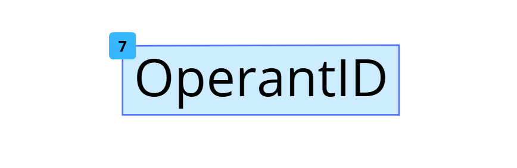

# OperantID 🤖

<p align="center">
  
</p>
<p align="center">
  <b>Universal Autonomous AI Agent Framework for High-Performance Browser Navigation and Automated Reasoning</b>
</p>

<p align="center">
  <a href="https://pypi.org/project/operantid"></a>
  <a href="https://www.python.org/downloads/"></a>
  <a href="https://opensource.org/licenses/MIT"></a>
  <a href="https://playwright.dev/python/"></a>
  
</p>

---

**OperantID** é um framework de raciocínio autônomo que orquestra Large Language Models e automação de navegadores para executar tarefas complexas na Web com precisão semântica. Diferentemente de ferramentas de RPA tradicionais baseadas em seletores estáticos frágeis, o OperantID utiliza um loop de percepção-raciocínio-ação contínuo para se adaptar dinamicamente a qualquer interface, estado de página ou fluxo de autenticação.

---

## Benchmarks Reais 🚀

Diferente de outros frameworks, o OperantID entrega performance consistente. Abaixo estão os resultados de um benchmark real executado com **Gemini 2.0 Flash**:

| Tarefa | Status | Passos | Tempo Total | Tempo Médio/Passo |
| :--- | :--- | :--- | :--- | :--- |
| **Pesquisa & Fact Check (Wikipedia)** | ✅ Pass | 5 | 13.91s | 2.78s |
| **Extração Direta (Quotes to Scrape)** | ✅ Pass | 2 | 5.79s | 2.89s |
| **Navegação & Busca (Google/Notícias)** | ✅ Pass | 5 | 19.43s | 3.89s |

> **Nota**: Testes realizados em modo headless em conexão banda larga padrão. O tempo inclui o delay de 2s para estabilização de navegação entre passos.

---

## Índice

- [Por que OperantID?](#por-que-operantid)
- [Arquitetura IRE](#arquitetura-ire)
- [Instalação](#instalação)
- [Quick Start](#quick-start)
- [Provedores de IA](#provedores-de-ia)
  - [Google Gemini](#google-gemini)
  - [OpenAI e Compatíveis](#openai-e-compatíveis)
  - [OpenRouter](#openrouter)
  - [Ollama (Local)](#ollama-local)
  - [Mistral AI](#mistral-ai)
- [Guia Completo de Uso](#guia-completo-de-uso)
  - [Inicialização do Agente](#inicialização-do-agente)
  - [Controle de Headless e Visibilidade](#controle-de-headless-e-visibilidade)
  - [Automação de Login com Credenciais](#automação-de-login-com-credenciais)
  - [Gestão de Múltiplas Abas](#gestão-de-múltiplas-abas)
  - [Callback on_step e Observabilidade](#callback-on_step-e-observabilidade)
  - [Controle de Max Steps](#controle-de-max-steps)
  - [Carregamento com .env](#carregamento-com-env)
- [Configurações Avançadas de Navegador](#configurações-avançadas-de-navegador)
  - [Seleção de Engine](#seleção-de-engine)
  - [Custom User-Agent](#custom-user-agent)
  - [Viewport Personalizado](#viewport-personalizado)
  - [Localização e Fuso Horário](#localização-e-fuso-horário)
- [Stealth Mode e Anti-Detecção](#stealth-mode-e-anti-detecção)
- [Sistema de Logging](#sistema-de-logging)
- [Playground WebUI](#playground-webui)
  - [Como usar](#como-usar)
  - [Aba Config](#aba-config)
  - [Aba Parameters](#aba-parameters)
  - [Aba Browser Settings](#aba-browser-settings)
  - [Aba Agent e Live Stream](#aba-agent-e-live-stream)
- [Referência Completa da API](#referência-completa-da-api)
  - [Classe Agent](#classe-agent)
  - [Classe BrowserManager](#classe-browsermanager)
  - [Ações Disponíveis para a IA](#ações-disponíveis-para-a-ia)
  - [Objeto AIResponse](#objeto-airesponse)
- [Exemplos Avançados](#exemplos-avançados)
- [Licença](#licença)

---

## Por que OperantID?

A maioria das ferramentas de automação Web falha por um motivo fundamental: elas dependem de seletores CSS ou XPath hardcoded que quebram na primeira atualização de layout do site.

O OperantID resolve isso com um paradigma radicalmente diferente:

- **Percepção Semântica**: Em vez de depender de IDs ou classes arbitrárias, o framework injeta um script de inspeção no DOM a cada passo, extraindo apenas os elementos visíveis e interativos. Isso elimina o ruído e fornece ao LLM apenas o que é relevante.
- **Raciocínio em Contexto**: O histórico completo de ações anteriores é fornecido ao LLM a cada passo, permitindo que ele construa uma memória de curto prazo e raciocine sobre o estado atual da missão.
- **Auto-Correção**: Se um clique por seletor falha, o agente automaticamente tenta localizar o elemento pelo seu texto visível, aumentando a resiliência da execução.
- **Provider-Agnostic**: Uma única API para rodar Gemini, OpenAI, Mistral, Groq, Ollama, DeepSeek e qualquer provedor compatível com a especificação OpenAI.

---

## Arquitetura IRE

O OperantID opera sobre o paradigma **IRE (Inspect → Reason → Execute)**, um ciclo contínuo que opera de forma assíncrona:

```
┌─────────────────────────────────────────────────────────┐
│                    MISSÃO DO AGENTE                     │
└─────────────────────────┬───────────────────────────────┘
                          │
                          ▼
         ┌────────────────────────────────┐
         │  INSPECT (Percepção Semântica)│
         │  ─────────────────────────── │
         │  Injeta script JS no DOM      │
         │  Extrai: URL, título, h1/h2,  │
         │  inputs, buttons, links,      │
         │  elementos ARIA visíveis      │
         │  Atribui data-operant-id a    │
         │  cada elemento interativo     │
         └──────────────┬─────────────────┘
                        │
                        ▼
         ┌────────────────────────────────┐
         │   REASON (LLM Decision)        │
         │   ─────────────────────────── │
         │  Contexto enviado ao LLM:      │
         │  - Objetivo original           │
         │  - Histórico de ações (n-k)    │
         │  - Mapa de elementos atual     │
         │  - Credenciais, se relevante   │
         │  Output: JSON estruturado      │
         │  com action, status, reasoning │
         └──────────────┬─────────────────┘
                        │
                        ▼
         ┌────────────────────────────────┐
         │   EXECUTE (Playwright Action)  │
         │   ─────────────────────────── │
         │  Traduz decisão JSON para      │
         │  comandos físicos:             │
         │  navigate, click, type,        │
         │  scroll, pressEnter, wait...   │
         │  Fallback automático por texto │
         └──────────────┬─────────────────┘
                        │
               status == "completed"?
                   │           │
                  Não          Sim
                   │           └──► Retorna resultado
                   └──► Próximo Passo (step + 1)
```

---

## Instalação

```bash
pip install operantid
```

Após instalar, é necessário baixar os binários do Playwright (apenas uma vez):

```bash
playwright install chromium
# Opcional: instalar Firefox e Webkit também
playwright install firefox webkit
```

---

## Quick Start

```python
import asyncio
from operantid import Agent

async def main():
    agent = Agent(
        api_key="SUA_API_KEY",
        provider="gemini",
        model="gemini-2.0-flash"
    )

    result = await agent.execute(
        "Vá ao DuckDuckGo e pesquise as últimas notícias sobre inteligência artificial"
    )

    print(result)

asyncio.run(main())
```

---

## Provedores de IA

O OperantID abstrai a comunicação com qualquer LLM através de um único parâmetro `provider`.

### Google Gemini

```python
agent = Agent(
    api_key="GOOGLE_API_KEY",
    provider="gemini",
    model="gemini-2.0-flash"  # ou gemini-1.5-pro, gemini-2.0-pro
)
```

> **Nota**: A `api_key` do Gemini pode ser obtida no [Google AI Studio](https://aistudio.google.com/app/apikey).

### OpenAI e Compatíveis

```python
agent = Agent(
    api_key="OPENAI_API_KEY",
    provider="openai",
    model="gpt-4o"  # ou gpt-4-turbo, gpt-4o-mini
)
```

### OpenRouter

Use qualquer modelo disponível no OpenRouter (Claude, Llama, Mistral, etc.) com o parâmetro `base_url`:

```python
agent = Agent(
    api_key="OPENROUTER_API_KEY",
    provider="openai",
    model="anthropic/claude-3.5-sonnet",
    base_url="https://openrouter.ai/api/v1"
)
```

### Ollama (Local)

Rode modelos 100% localmente. Não exige API key:

```python
agent = Agent(
    api_key="ollama",  # valor placeholder, não é validado
    provider="openai",
    model="llama3.2",
    base_url="http://localhost:11434/v1"
)
```

### Mistral AI

```python
agent = Agent(
    api_key="MISTRAL_API_KEY",
    provider="mistral",
    model="mistral-large-latest"  # ou codestral, mistral-small
)
```

---

## Guia Completo de Uso

### Inicialização do Agente

```python
from operantid import Agent

agent = Agent(
    api_key="SUA_API_KEY",
    provider="gemini",           # gemini | openai | mistral
    model="gemini-2.0-flash",    # Opcional. Usa o modelo padrão do provider se omitido
    base_url=None,               # Para endpoints customizados (OpenRouter, Ollama, etc.)
    headless=False,              # True: navegador invisível, False: visível
    email=None,                  # Credencial para login automático
    password=None,               # Credencial para login automático
    browser_config={}            # Configurações avançadas do navegador (ver seção abaixo)
)
```

### Controle de Headless e Visibilidade

```python
# Modo Visível — ideal para desenvolvimento e debugging
agent = Agent(api_key="...", provider="gemini", headless=False)

# Modo Headless — ideal para produção e servidores
agent = Agent(api_key="...", provider="gemini", headless=True)
```

### Automação de Login com Credenciais

O OperantID possui injeção de credenciais no prompt do agente. Ao fornecer `email` e `password`, o LLM é instruído a usar essas credenciais automaticamente sempre que encontrar formulários de autenticação.

```python
agent = Agent(
    api_key="SUA_API_KEY",
    provider="gemini",
    email="seu_login@empresa.com",
    password="SuaSenhaSegura123"
)

# O agente fará login automaticamente sem você precisar codificar o fluxo
result = await agent.execute(
    "Acesse meu painel no GitHub e liste os repositórios com mais estrelas"
)
```

> **Segurança**: As credenciais são mantidas apenas na memória durante a execução e nunca são logadas em disco ou enviadas para terceiros além do provedor de IA escolhido.

### Gestão de Múltiplas Abas

O agente opera sobre um contexto de browser multi-aba nativo. Ele pode abrir, navegar, trocar e fechar abas de forma autônoma:

```python
result = await agent.execute(
    "Abra o Amazon.com.br e o Mercado Livre em abas separadas, "
    "pesquise por 'RTX 4070' em ambos e me diga qual está mais barato"
)
```

Internamente, o agente usa as ações `createTab`, `switchTab` e `closeTab` para gerenciar o contexto.

### Callback on_step e Observabilidade

O parâmetro `on_step` permite interceptar cada passo do agente em tempo real. A função pode ser síncrona ou assíncrona:

```python
import asyncio
from operantid import Agent

async def inspecionar_passo(data: dict):
    step = data["step"]
    reasoning = data["reasoning"]
    action = data.get("action")

    print(f"\n[PASSO {step}]")
    print(f"  Raciocínio: {reasoning}")
    if action:
        print(f"  Ação: {action['type']} | Seletor: {action.get('selector')}")

async def main():
    agent = Agent(api_key="...", provider="gemini")
    result = await agent.execute(
        "Pesquise por Python no Google",
        on_step=inspecionar_passo
    )
    print("\nResultado:", result)

asyncio.run(main())
```

**Estrutura do dicionário `data` recebido pelo `on_step`:**

```python
{
    "step": 3,                          # Número do passo atual
    "reasoning": "Vou clicar no...",    # Raciocínio interno do LLM
    "action": {                         # None se o LLM marcou status=completed
        "type": "click",
        "selector": '[data-operant-id="4"]',
        "text": "Pesquisar",
        "url": None,
        "direction": None,
        "ms": None,
        "tabId": None,
        "message": None
    },
    "message": None                     # Mensagem de conclusão (se status=completed)
}
```

### Controle de Max Steps

Por padrão, o agente executa no máximo 25 passos por missão. Você pode ajustar esse limite:

```python
agent = Agent(api_key="...", provider="gemini")
agent.max_steps = 50  # Missões mais longas e complexas

result = await agent.execute("Preencha o formulário de cadastro completo em exemplo.com")
```

### Carregamento com .env

```python
# .env
GOOGLE_API_KEY=AIzaSy...
OPENAI_API_KEY=sk-...
```

```python
from dotenv import load_dotenv
import os
from operantid import Agent

load_dotenv()

agent = Agent(
    api_key=os.getenv("GOOGLE_API_KEY"),
    provider="gemini"
)
```

---

## Configurações Avançadas de Navegador

O parâmetro `browser_config` aceita uma configuração granular do contexto do Playwright:

### Seleção de Engine

```python
agent = Agent(
    api_key="...",
    provider="gemini",
    browser_config={
        "browser_type": "firefox"   # chromium (padrão) | firefox | webkit
    }
)
```

> Para usar `firefox` ou `webkit`, certifique-se de ter instalado com `playwright install firefox webkit`.

### Custom User-Agent

Simule qualquer dispositivo ou navegador:

```python
browser_config = {
    # iPhone 15 Pro
    "user_agent": "Mozilla/5.0 (iPhone; CPU iPhone OS 17_0 like Mac OS X) AppleWebKit/605.1.15 (KHTML, like Gecko) Version/17.0 Mobile/15E148 Safari/604.1",

    # Ou um Windows com Edge
    # "user_agent": "Mozilla/5.0 (Windows NT 10.0; Win64; x64) AppleWebKit/537.36 (KHTML, like Gecko) Chrome/122.0.0.0 Safari/537.36 Edg/122.0.0.0"
}
```

### Viewport Personalizado

```python
browser_config = {
    "viewport": {"width": 1920, "height": 1080},   # Full HD Desktop
    # "viewport": {"width": 390, "height": 844},   # iPhone 14
    # "viewport": {"width": 768, "height": 1024},  # iPad
}
```

### Localização e Fuso Horário

Ideal para testar comportamentos regionais (moedas, idiomas, fusos):

```python
browser_config = {
    "locale": "en-US",
    "timezone": "America/New_York"
}

# Ou para simular um usuário europeu:
browser_config = {
    "locale": "de-DE",
    "timezone": "Europe/Berlin"
}
```

**Exemplo completo com todas as opções:**

```python
from operantid import Agent

agent = Agent(
    api_key="SUA_API_KEY",
    provider="openai",
    model="gpt-4o",
    headless=True,
    browser_config={
        "browser_type": "chromium",
        "user_agent": "Mozilla/5.0 (Windows NT 10.0; Win64; x64) ...",
        "viewport": {"width": 1920, "height": 1080},
        "locale": "pt-BR",
        "timezone": "America/Sao_Paulo"
    }
)
```

---

## Stealth Mode e Anti-Detecção

O OperantID integra o `playwright-stealth` nativamente. Em todas as páginas e abas criadas, a biblioteca aplica automaticamente um conjunto de patches JavaScript que:

- Remove a flag `navigator.webdriver = true`
- Simula plugins de navegador realistas
- Corrige inconsistências em `navigator.plugins` e `navigator.languages`
- Mascara assinaturas de automação no `window.chrome`

Isso permite que o agente navegue em sites com Cloudflare, Datadome, reCAPTCHA leve e outros sistemas anti-bot sem configurações adicionais.

---

## Sistema de Logging

O OperantID usa o `Logger` interno com output colorido no terminal:

| Emoji | Tipo | Descrição |
|:------|:-----|:----------|
| `🔍` | `inspect` | Inspeção semântica da página atual |
| `🤔` | `info` | Raciocínio interno do LLM |
| `⚡` | `action` | Ação física executada no navegador |
| `✅` | `success` | Missão concluída com sucesso |
| `⚠️` | `warning` | Aviso não-crítico (ex: elemento não encontrado, fallback por texto) |
| `❌` | `error` | Erro durante a execução |

Para garantir suporte a cores no Windows, instale `colorama`:

```bash
pip install colorama
```

---

## Playground WebUI

O OperantID vem com uma interface web profissional integrada que permite usar o agente sem escrever código. Ideal para demos, prototipagem rápida e debugging visual.

### Como usar

```python
from operantid import launch_ui

# Sobe o servidor na porta 5000 (padrão)
launch_ui()

# Ou em uma porta customizada
launch_ui(port=8080)
```

Acesse `http://127.0.0.1:5000` no seu navegador.

### Aba Config

Configure o provedor de IA, API Key, modelo e Base URL customizada. Suporta qualquer endpoint compatível com a API OpenAI.

### Aba Parameters

- `Max Steps`: Limite máximo de ações por missão.
- `Headless Mode`: Oculta ou exibe o navegador durante a execução.
- `Streaming (Beta)`: Ativa o Live Browser Stream na aba Agent.
- `Email / Senha`: Credenciais para login automático.

### Aba Browser Settings

Controle completo sobre a configuração do navegador da IA:

- **Browser Engine**: Chromium, Firefox ou Webkit.
- **User Agent**: Simule qualquer dispositivo.
- **Viewport**: Resolução da janela do navegador.
- **Locale / Timezone**: Regionalização completa.

### Aba Agent e Live Stream

A aba principal de operação. Composta por:

- **OPERANT.VISION**: Painel de streaming ao vivo do navegador da IA (16:9), atualizado a cada segundo via polling de screenshots JPEG.
- **MISSION_CONTROL**: Input de missão em texto livre, botão de lançamento e badge de status em tempo real.
- **TELEMETRY_LOGS**: Terminal embutido que exibe o output completo do servidor Python em tempo real, incluindo inspeções, raciocínios, cliques e logs de rede.

---

## Referência Completa da API

### Classe Agent

```python
class Agent:
    def __init__(
        self,
        api_key: str,
        model: str = None,
        provider: str = "openai",
        base_url: str = None,
        headless: bool = False,
        email: str = None,
        password: str = None,
        browser_config: dict = None
    ): ...

    async def execute(
        self,
        command: str,
        on_step: Callable[[dict], None | Awaitable[None]] = None
    ) -> dict: ...
```

**Retorno de `execute()`:**

```python
# Sucesso
{"success": True, "message": "Missão concluída com sucesso.", "steps": 7}

# Falha por limite de passos
{"success": False, "error": "Max steps reached", "steps": 25}

# Falha por exceção
{"success": False, "error": "Mensagem do erro", "steps": 3}
```

### Classe BrowserManager

O `BrowserManager` é instanciado internamente pelo `Agent`, mas pode ser usado diretamente para casos de uso customizados:

```python
from operantid.browser import BrowserManager

browser = BrowserManager(headless=True, config={
    "browser_type": "firefox",
    "viewport": {"width": 1280, "height": 720}
})

await browser.start()
await browser.navigate("https://example.com")
info = await browser.inspect()
screenshot_b64 = await browser.get_screenshot()
await browser.stop()
```

**Métodos disponíveis:**

| Método | Descrição |
|:-------|:----------|
| `start()` | Inicializa o Playwright e abre o navegador |
| `stop()` | Fecha o navegador e libera recursos |
| `navigate(url)` | Navega para uma URL (adiciona `https://` automaticamente) |
| `inspect()` | Retorna o estado semântico atual da página |
| `click(selector, text)` | Clica em um elemento (com fallback por texto) |
| `type_text(selector, text)` | Preenche um campo de texto |
| `scroll(direction)` | Rola a página (`up` ou `down`) |
| `press_enter()` | Pressiona a tecla Enter |
| `wait(ms)` | Aguarda N milissegundos |
| `reload()` | Recarrega a página atual |
| `back()` | Navega para a página anterior |
| `forward()` | Navega para a próxima página |
| `create_tab(url)` | Abre uma nova aba |
| `switch_tab(index)` | Ativa uma aba pelo índice |
| `close_tab(index)` | Fecha uma aba pelo índice |
| `get_tabs_info()` | Retorna lista de abas abertas com URL e status |
| `get_screenshot()` | Captura a tela atual como JPEG em Base64 |

### Ações Disponíveis para a IA

O LLM decide a próxima ação retornando um JSON com o campo `action.type`:

| Ação | Parâmetros Relevantes | Descrição |
|:-----|:----------------------|:----------|
| `navigate` | `url` | Navega para uma URL |
| `click` | `selector`, `text` | Clica em um elemento |
| `type` | `selector`, `text` | Digita texto em um campo |
| `scroll` | `direction` (`up`/`down`) | Rola a página |
| `pressEnter` | — | Pressiona Enter |
| `wait` | `ms` | Aguarda N milissegundos |
| `reload` | — | Recarrega a página |
| `back` | — | Volta uma página |
| `forward` | — | Avança uma página |
| `createTab` | `url` | Abre nova aba |
| `switchTab` | `tabId` | Troca de aba por índice |
| `closeTab` | `tabId` | Fecha uma aba |
| `talk` | `message` | Envia mensagem ao usuário sem encerrar |
| `completed` | `message` | Marca a missão como concluída |

### Objeto AIResponse

Estrutura interna retornada pelo LLM a cada passo:

```python
class AIResponse(BaseModel):
    status: str           # "continue" | "completed"
    action: AgentAction   # A ação a ser executada (None se completed)
    reasoning: str        # Raciocínio explicando a decisão
    message: str          # Mensagem final (apenas quando completed)
```

---

## Exemplos Avançados

### Pipeline de Pesquisa Comparativa Multi-Site

```python
import asyncio
from operantid import Agent

async def pesquisa_comparativa():
    agent = Agent(
        api_key="SUA_API_KEY",
        provider="gemini",
        model="gemini-2.0-flash",
        headless=False,
        browser_config={"viewport": {"width": 1600, "height": 900}}
    )
    agent.max_steps = 40

    result = await agent.execute(
        "Abra o Amazon.com.br e o Mercado Livre em abas separadas. "
        "Em cada um, pesquise por 'Headset Gamer'. "
        "Liste o produto mais barato encontrado em cada site e compare os preços."
    )
    print(result)

asyncio.run(pesquisa_comparativa())
```

### Automação de Formulário com Login

```python
import asyncio
from dotenv import load_dotenv
import os
from operantid import Agent

load_dotenv()

async def preencher_formulario():
    agent = Agent(
        api_key=os.getenv("OPENAI_API_KEY"),
        provider="openai",
        model="gpt-4o",
        email=os.getenv("SITE_EMAIL"),
        password=os.getenv("SITE_PASSWORD"),
        headless=False
    )

    result = await agent.execute(
        "Acesse meusite.com/dashboard, faça login e "
        "preencha o formulário de 'Novo Relatório' com as informações: "
        "Título: Relatório Março 2026, Categoria: Financeiro, "
        "e clique em Salvar."
    )
    print(result)

asyncio.run(preencher_formulario())
```

### Monitoramento em Tempo Real com on_step

```python
import asyncio
import json
from operantid import Agent

action_log = []

async def monitor(data):
    action_log.append(data)
    if data.get("action"):
        tipo = data["action"]["type"]
        print(f"[STEP {data['step']}] {tipo.upper()} — {data['reasoning'][:80]}...")

async def main():
    agent = Agent(api_key="...", provider="mistral", model="mistral-large-latest")
    result = await agent.execute("Verifique o preço do Bitcoin no CoinGecko", on_step=monitor)

    # Salva log completo
    with open("agent_log.json", "w") as f:
        json.dump(action_log, f, ensure_ascii=False, indent=2)

    print(result)

asyncio.run(main())
```

### Usando a WebUI no seu Projeto

```python
from operantid import launch_ui

# Inicia o Playground em segundo plano na porta 8000
launch_ui(port=8000)
```

---

## Licença

Este projeto está sob a licença **MIT**. Você pode usar, modificar e distribuir livremente, inclusive em projetos comerciais.

```
MIT License

Copyright (c) 2026 Junior_7i

Permission is hereby granted, free of charge, to any person obtaining a copy
of this software and associated documentation files (the "Software"), to deal
in the Software without restriction, including without limitation the rights
to use, copy, modify, merge, publish, distribute, sublicense, and/or sell
copies of the Software, and to permit persons to whom the Software is
furnished to do so, subject to the following conditions:

The above copyright notice and this permission notice shall be included in all
copies or substantial portions of the Software.
```

---

<p align="center">Desenvolvido com ❤️ por <b>Junior_7i</b></p>
